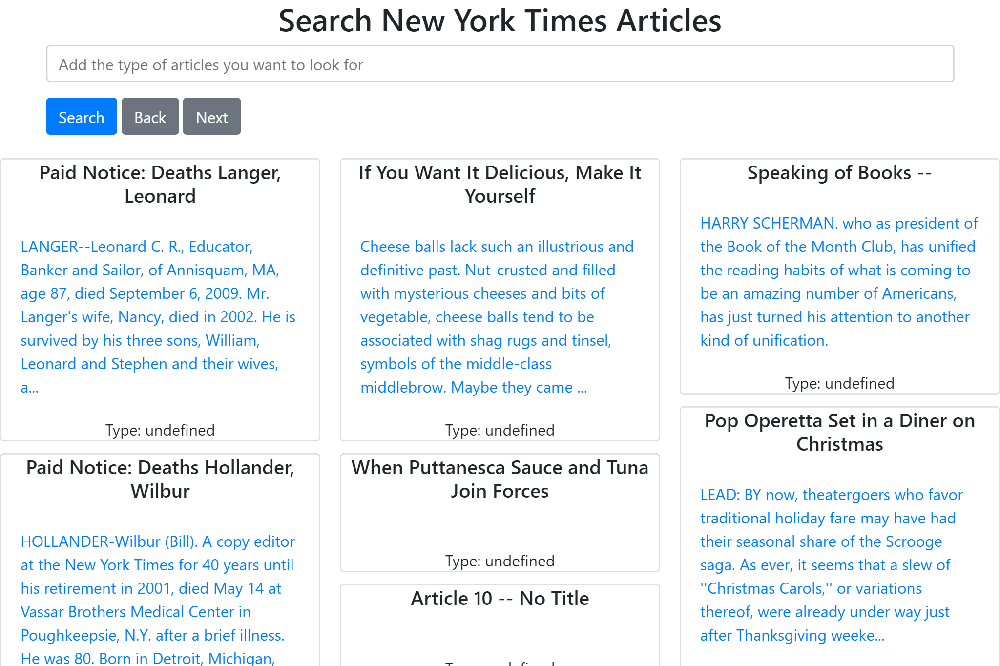
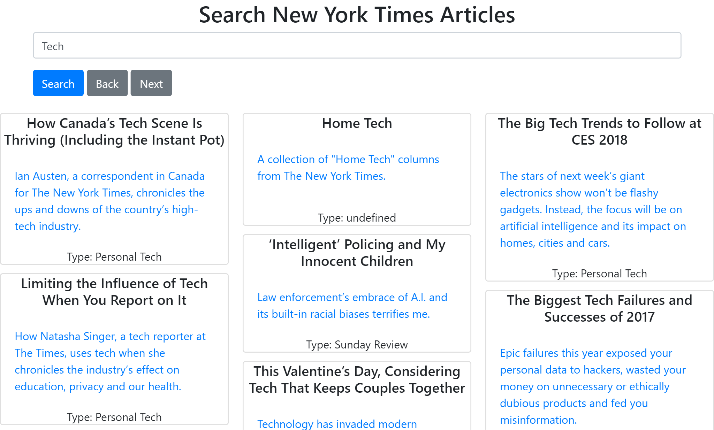

# New_York_Times_Fetch_API_JS
<strong>Description:</strong> A User Profile that uses the Bootstrap4 framework. Uses JavaScript localStorage to keep track of if you are following the user or not. When the user is being followed, the css of the application changes

<strong>Screenshot One:</strong>

  

<strong>Screenshot Two:</strong>

  

